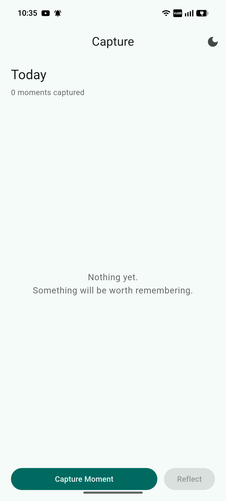
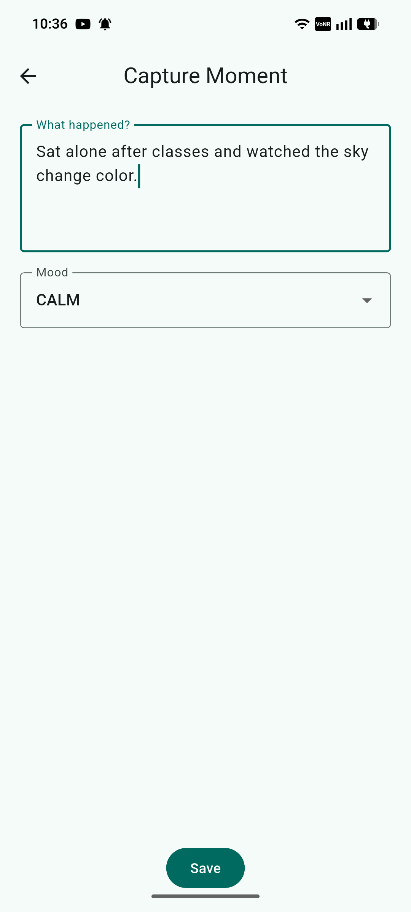
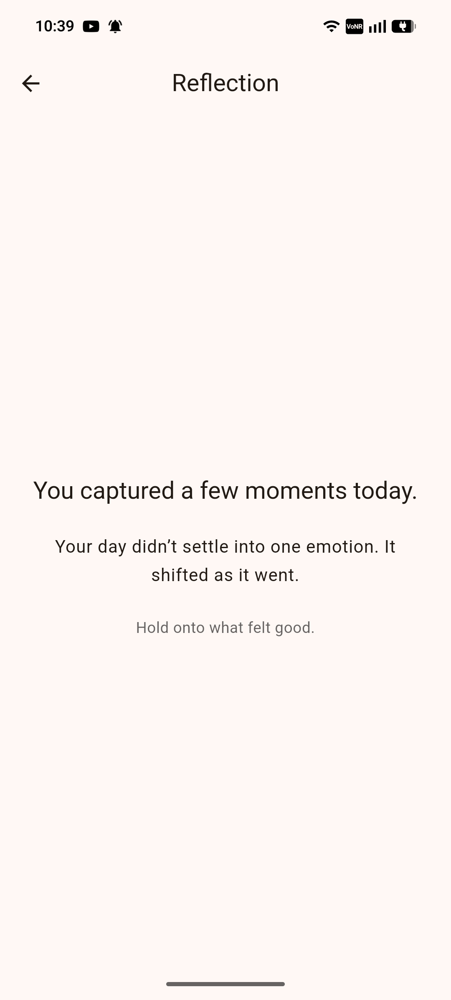

# Capture

Capture is a minimal Flutter app for recording daily moments and reflecting on emotional patterns.

## Features
- Capture short daily moments with a selected mood
- Dynamic app theming based on mood
- Light / dark mode toggle
- Reflection screen that summarizes the day

## Tech Stack
- Flutter
- Dart
- Material 3

## Project Structure
- `lib/main.dart` — core application logic and UI

## How to Run
```bash
flutter pub get
flutter run
```

## Notes

This project was built as part of a Flutter codelab assignment to explore widgets, state, navigation, and theming.

## Screenshots

### Home


### Capture Moment


### Reflection


### Dark Mode

